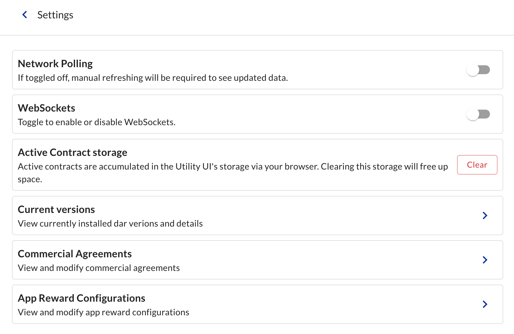
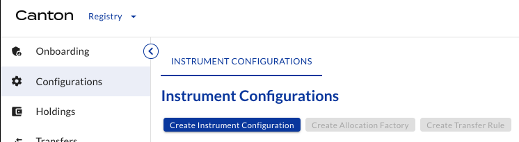
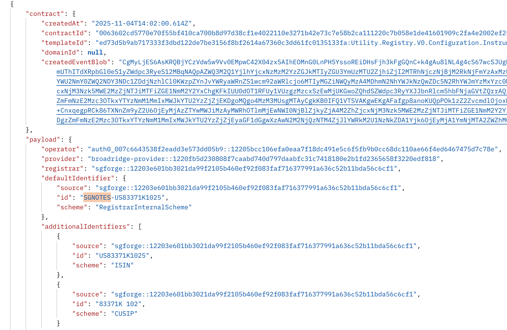

# Mainnet Issuance - November, 2025 <!-- omit in toc -->

## Table of Contents <!-- omit in toc -->

- [Documentation](#documentation)
- [Key Dates](#key-dates)
- [URLs \& Versions](#urls--versions)
- [PartyIDs](#partyids)
- [Status](#status)
  - [Step 0: Infrastructure Setup](#step-0-infrastructure-setup)
  - [Step 1: Onboarding roles](#step-1-onboarding-roles)
  - [Step 2: Configuring tokens](#step-2-configuring-tokens)
  - [Step 3: Issuing tokens](#step-3-issuing-tokens)
- [Detailed instructions](#detailed-instructions)
  - [0.1 Setup BR node](#01-setup-br-node)
  - [0.2 Setup SG node](#02-setup-sg-node)
  - [0.3 Setup DRW node](#03-setup-drw-node)
  - [1.1 Credential User Service for all entities](#11-credential-user-service-for-all-entities)
  - [1.2 Provider credential](#12-provider-credential)
  - [1.3 Onboard Provider](#13-onboard-provider)
  - [1.4 Onboard Registrar](#14-onboard-registrar)
  - [1.5 / 1.6 Registrar credential](#15--16-registrar-credential)
  - [1.10 / 1.11 Registrar onboarding](#110--111-registrar-onboarding)
  - [2.1 Registrar creates Allocation Factory, Transfer Rule and specifies Instrument Configuration](#21-registrar-creates-allocation-factory-transfer-rule-and-specifies-instrument-configuration)
  - [2.2 / 2.3 / 2.4 / 2.5 Registrar offers credential to Issuer and Holders](#22--23--24--25-registrar-offers-credential-to-issuer-and-holders)
  - [3.1 Issuer requests token issuance (minting)](#31-issuer-requests-token-issuance-minting)
  - [3.2 Registrar accepts and tokens are issued](#32-registrar-accepts-and-tokens-are-issued)
  - [3.3 Issuer offers token transfer to Investors](#33-issuer-offers-token-transfer-to-investors)
  - [3.4 Investor accepts transfer](#34-investor-accepts-transfer)

## Documentation

- [Issuing Tokenized Instruments](https://docs.digitalasset.com/utilities/testnet/tutorials/issuance/introduction.html)
- [Transfering Tokenized Instruments](https://docs.digitalasset.com/utilities/testnet/tutorials/transfer/index.html)
- [Redeeming Tokenized Instruments](https://docs.digitalasset.com/utilities/testnet/tutorials/redemption/index.html)

## Key Dates

- Trade date : 11/06/2025
- Issue Date (= Settlement date) : 11/13/2025
- Press Release :  11/17/2025
- Maturity Date : [02/16/2026 or 02/12/2026] TBC

## URLs & Versions

| Entity                | Details                                                       | Utility UI version |
| :-------------------- | :------------------------------------------------------------ | ------------------ |
| Broadridge (BR)       | https://utility-broadridge.broadridge.catalyst.intellecteu.io | 0.9.2              |
| SG Forge (SGF)        | https://utility-socgen.broadridge.catalyst.intellecteu.io     | 0.9.2              |
| SG Paris (SGPM)       | https://utility-socgen.broadridge.catalyst.intellecteu.io     | 0.9.2              |
| DRW Strategies (DRWS) | https://drws-ui.validator.global.canton.network.cumberland.io | TBC                |

## PartyIDs

| Entity     | Party ID                                                                                    |
| :--------- | :------------------------------------------------------------------------------------------ |
| Broadridge | `broadridge-provider::1220fb5d230808f7caabd740d797daabfc31c7418180e2b1fd2365658f3220edf818` |
| SG Forge   | `sgforge::12203e601bb3021da99f2105b460ef92f083faf716377991a636c52b11bda56c6cf1`             |
| SG Paris   | `sgpm::12203e601bb3021da99f2105b460ef92f083faf716377991a636c52b11bda56c6cf1`                |
| DRWS       | `Cumberland-DRWS-1::1220f792fc36ceb9f88536e862f0923f1b655cccb9a711ee4d5ede1397ad722bb155`   |

## Status

### Step 0: Infrastructure Setup

| Steps                                    | IEU  | BR   | SGF  | SGPM | DRWS |
| :--------------------------------------- | :--- | :--- | :--- | :--- | :--- |
| [0.1 Setup BR node](#01-setup-br-node)   | ✅    | ✅    | -    | -    | -    |
| [0.2 Setup SG node](#02-setup-sg-node)   | ✅    | -    | ✅    | ✅    | -    |
| [0.3 Setup DRW node](#03-setup-drw-node) | -    | -    | -    | -    | ✅    |

### Step 1: Onboarding roles

| Steps                                                                                        | DA   | BR   | SGF  | SGPM | DRWS |
| :------------------------------------------------------------------------------------------- | :--- | :--- | :--- | :--- | :--- |
| [1.1 Credential User Service for all entities](#11-credential-user-service-for-all-entities) | -    | ✅    | ✅    | ✅    | ✅    |
| [1.2 Provider credential](#12-provider-credential)                                           | ✅    | ✅    | -    | -    | -    |
| [1.3 Onboard Provider](#13-onboard-provider)                                                 | ✅    | ✅    | -    | -    | -    |
| [1.4 Onboard Registrar](#14-onboard-registrar)                                               | -    | ✅    | -    | -    | -    |
| [1.5 / 1.6 Registrar credential](#15--16-registrar-credential)                               | -    | ✅    | ✅    | -    | -    |
| [1.10 / 1.11 Registrar onboarding](#110--111-registrar-onboarding)                           | -    | ✅    | ✅    | -    | -    |

### Step 2: Configuring tokens

| Steps                                                                                                                                                                                           | DA   | BR   | SGF  | SGPM | DRWS |
| :---------------------------------------------------------------------------------------------------------------------------------------------------------------------------------------------- | :--- | :--- | :--- | :--- | :--- |
| [2.1 Registrar creates Allocation Factory, Transfer Rule and specifies Instrument Configuration](#21-registrar-creates-allocation-factory-transfer-rule-and-specifies-instrument-configuration) | -    | -    | ✅    | -    | -    |
| [2.2 / 2.3 / 2.4 / 2.5 Registrar offers credential to Issuer and Holders](#22--23--24--25-registrar-offers-credential-to-issuer-and-holders)                                                    | -    | -    | ✅    | ✅    | ✅    |

### Step 3: Issuing tokens

| Steps                                                                                          | DA   | BR   | SGF  | SGPM | DRWS |
| :--------------------------------------------------------------------------------------------- | :--- | :--- | :--- | :--- | :--- |
| [3.1 Issuer requests token issuance (minting)](#31-issuer-requests-token-issuance-minting)     | -    | -    | -    | 📌    | -    |
| [3.2 Registrar accepts and tokens are issued](#32-registrar-accepts-and-tokens-are-issued)     | -    | -    | 📌    | -    | -    |
| [3.3 Issuer offers token transfer to Investors](#33-issuer-offers-token-transfer-to-investors) | -    | -    | -    | 📌    | -    |
| [3.4 Investor accepts transfer](#34-investor-accepts-transfer)                                 | -    | -    | -    | -    | 📌    |

## Detailed instructions

### 0.1 Setup BR node

IEU replicate Testnet #3 configuration of BR node on mainnet:

- url: https://utility-broadridge.broadridge.catalyst.intellecteu.io
- partyIDs: `broadridge-provider::1220fb5d230808f7caabd740d797daabfc31c7418180e2b1fd2365658f3220edf818`
- access credentials shared securely

BR confirms that they are able to access (no IP restriction issues, no firewall issues, no polling issues).

BR turns off `Network Polling` and `Websockets` to avoid potential corporate firewall issues.

### 0.2 Setup SG node

IEU replicate Testnet #3 configuration of SG node on mainnet:

- url: https://utility-socgen.broadridge.catalyst.intellecteu.io
- partyIDs: `sgforge::12203e601bb3021da99f2105b460ef92f083faf716377991a636c52b11bda56c6cf1`, `sgpm::12203e601bb3021da99f2105b460ef92f083faf716377991a636c52b11bda56c6cf1`
- access credentials shared securely

SGF and SGPM confirm that they are able to access (no IP restriction issues, no firewall issues).

### 0.3 Setup DRW node

DRW to replicate Testnet #3 configuration of DRW node on mainnet:

- url: https://drws-ui.validator.global.canton.network.cumberland.io
- partyIDs: `Cumberland-DRWS-1::1220f792fc36ceb9f88536e862f0923f1b655cccb9a711ee4d5ede1397ad722bb155`
- access credentials shared securely

DRWS confirms that they are able to access.

### 1.1 Credential User Service for all entities

| Actor               | Module     | Tab        |
| :------------------ | :--------- | :--------- |
| BR, SGF, SGPM, DRWS | Credential | Onboarding |

BR, SGF, SGPM, DRWS click on `Request Credential User Service`.

See [tutorial](https://docs.digitalasset.com/utilities/testnet/tutorials/issuance/1-onboarding.html#onboarding-credential-services-for-all-entities) for details.

### 1.2 Provider credential

| Actors | Module     | Tab                 |
| :----- | :--------- | :------------------ |
| DA, BR | Credential | Credentials, Offers |

DA offers to BR a Provider credential (Credentials tab), and BR accepts it (Offers tab):

| Item        | Value                                                                                       |
| :---------- | :------------------------------------------------------------------------------------------ |
| holder      | `broadridge-provider::1220fb5d230808f7caabd740d797daabfc31c7418180e2b1fd2365658f3220edf818` |
| id          | `Broadridge provider`                                                                       |
| description | `Broadridge provider`                                                                       |
| Subject     | `broadridge-provider::1220fb5d230808f7caabd740d797daabfc31c7418180e2b1fd2365658f3220edf818` |
| Property    | `hasRegistryRole`                                                                           |
| Value       | `Provider`                                                                                  |

See [tutorial](https://docs.digitalasset.com/utilities/testnet/tutorials/issuance/1-onboarding.html#provider-credential) for details.

### 1.3 Onboard Provider

| Actors | Module   | Tab        |
| :----- | :------- | :--------- |
| DA, BR | Registry | Onboarding |

BR clicks on `Requests Provider Service`, and DA accepts.

See [tutorial](https://docs.digitalasset.com/utilities/testnet/tutorials/issuance/1-onboarding.html#onboard-provider) for details.

### 1.4 Onboard Registrar

| Actors | Module   | Tab           |
| :----- | :------- | :------------ |
| BR     | Registry | Configuration |

BR creates a Provider Configuration.

Required credentials for Registrars

| Item              | Value                                                                                       |
| :---------------- | :------------------------------------------------------------------------------------------ |
| Credential Issuer | `broadridge-provider::1220fb5d230808f7caabd740d797daabfc31c7418180e2b1fd2365658f3220edf818` |
| Property          | `hasRegistryRole`                                                                           |
| Value             | `Registrar`                                                                                 |

> Note: Credentials for Holders are no longer required. Whitelisting is done by the Registrar at the Instrument Configuration level.

See [tutorial](https://docs.digitalasset.com/utilities/testnet/tutorials/issuance/1-onboarding.html#onboarding-requirements-for-registrars-and-holders) for details.

### 1.5 / 1.6 Registrar credential

| Actors  | Module     | Tab                 |
| :------ | :--------- | :------------------ |
| BR, SGF | Credential | Credentials, Offers |

BR offers to SGF a Registrar credential (Credentials tab), and SGF accepts it (Offers tab).

| Item        | Value                                                                           |
| :---------- | :------------------------------------------------------------------------------ |
| holder      | `sgforge::12203e601bb3021da99f2105b460ef92f083faf716377991a636c52b11bda56c6cf1` |
| id          | `SG Forge registrar`                                                            |
| description | `SG Forge registrar`                                                            |
| Subject     | `sgforge::12203e601bb3021da99f2105b460ef92f083faf716377991a636c52b11bda56c6cf1` |
| Property    | `hasRegistryRole`                                                               |
| Value       | `Registrar`                                                                     |

See [tutorial](https://docs.digitalasset.com/utilities/testnet/tutorials/issuance/1-onboarding.html#provider-offers-registrar-credential)for details.

### 1.10 / 1.11 Registrar onboarding

| Actors  | Module   | Tab        |
| :------ | :------- | :--------- |
| SGF, BR | Registry | Onboarding |

SGF clicks on `Request Registrar Service`, and BR accepts.

| Item     | Value                                                                                       |
| :------- | :------------------------------------------------------------------------------------------ |
| Provider | `broadridge-provider::1220fb5d230808f7caabd740d797daabfc31c7418180e2b1fd2365658f3220edf818` |

See [tutorial](https://docs.digitalasset.com/utilities/testnet/tutorials/issuance/1-onboarding.html#registrar-requests-onboarding-as-a-registrar-in-the-registry) for details.

### 2.1 Registrar creates Allocation Factory, Transfer Rule and specifies Instrument Configuration

| Actors | Module   | Tab           |
| :----- | :------- | :------------ |
| SGF    | Registry | Configuration |

SGF clicks on `Create Allocation Factory` and `Create Transfer Rule`.

Both boxes should turn from blue to grey.

SGF creates Instrument Configuration:

| Item                        | Value                                                                           |
| :-------------------------- | :------------------------------------------------------------------------------ |
| Instrument ID               | `SGNOTES-US83371K1025`                                                          |
| Identifiers                 |                                                                                 |
| Source                      | `sgforge::12203e601bb3021da99f2105b460ef92f083faf716377991a636c52b11bda56c6cf1` |
| Id                          | `US83371K1025`                                                                  |
| Scheme                      | ISIN                                                                            |
| Source                      | `sgforge::12203e601bb3021da99f2105b460ef92f083faf716377991a636c52b11bda56c6cf1` |
| Id                          | `83371K 102`                                                                    |
| Scheme                      | CUSIP                                                                           |
| Requirement for Mint Issuer |                                                                                 |
| Credential Issuer           | `sgforge::12203e601bb3021da99f2105b460ef92f083faf716377991a636c52b11bda56c6cf1` |
| Property                    | `isIssuerOf`                                                                    |
| Value                       | `SGNOTES`                                                                       |
| Requirement for Holders     |                                                                                 |
| Credential Issuer           | `sgforge::12203e601bb3021da99f2105b460ef92f083faf716377991a636c52b11bda56c6cf1` |
| Property                    | `isHolderOf`                                                                    |
| Value                       | `SGNOTES`                                                                       |

End point to check view the Instrument Configuration: https://api.utilities.digitalasset.com//api/utilities/v0/contract/instrument-configuration/all

See [tutorial](https://docs.digitalasset.com/utilities/testnet/tutorials/issuance/2-credentials.html#registrar-specifying-the-requirement-of-the-bond-token) for details.

### 2.2 / 2.3 / 2.4 / 2.5 Registrar offers credential to Issuer and Holders

| Actors          | Module     | Tab                 |
| :-------------- | :--------- | :------------------ |
| SGF, SGPM, DRWS | Credential | Credentials, Offers |

SGF issues free credentials (Credentials tab), and SGPM / DRWS accept them (Offers tab).

SG Paris Issuer of SGNOTES credential:

| Item        | Value                                                                        |
| :---------- | :--------------------------------------------------------------------------- |
| holder      | `sgpm::12203e601bb3021da99f2105b460ef92f083faf716377991a636c52b11bda56c6cf1` |
| id          | `SGPM-SGNOTES-Issuer`                                                        |
| description | `SGPM-SGNOTES-Issuer`                                                        |
| Subject     | `sgpm::12203e601bb3021da99f2105b460ef92f083faf716377991a636c52b11bda56c6cf1` |
| Property    | `isIssuerOf`                                                                 |
| Value       | `SGNOTES`                                                                    |

SG Paris Holder of SGNOTES credential:

| Item        | Value                                                                        |
| :---------- | :--------------------------------------------------------------------------- |
| holder      | `sgpm::12203e601bb3021da99f2105b460ef92f083faf716377991a636c52b11bda56c6cf1` |
| id          | `SGPM-SGNOTES-Holder`                                                        |
| description | `SGPM-SGNOTES-Holder`                                                        |
| Subject     | `sgpm::12203e601bb3021da99f2105b460ef92f083faf716377991a636c52b11bda56c6cf1` |
| Property    | `isHolderOf`                                                                 |
| Value       | `SGNOTES`                                                                    |

DRWS Holder of SGNOTES credential

| Item        | Value                                                                                     |
| :---------- | :---------------------------------------------------------------------------------------- |
| holder      | `Cumberland-DRWS-1::1220f792fc36ceb9f88536e862f0923f1b655cccb9a711ee4d5ede1397ad722bb155` |
| id          | `DRWS-SGNOTES-Holder`                                                                     |
| description | `DRWS-SGNOTES-Holder`                                                                     |
| Subject     | `Cumberland-DRWS-1::1220f792fc36ceb9f88536e862f0923f1b655cccb9a711ee4d5ede1397ad722bb155` |
| Property    | `isHolderOf`                                                                              |
| Value       | `SGNOTES`                                                                                 |

See [tutorial](https://docs.digitalasset.com/utilities/testnet/tutorials/issuance/2-credentials.html#registrar-offers-credential-of-token-issuer-and-holder-to-issuer) for details.

### 3.1 Issuer requests token issuance (minting)

| Actors | Module   | Tab   |
| :----- | :------- | :---- |
| SGPM   | Registry | Mints |

| Item       | Value                                                                           |
| :--------- | :------------------------------------------------------------------------------ |
| Instrument | `SGNOTES-US83371K1025`                                                          |
| Amount     | `1000000`                                                                       |
| Registrar  | `sgforge::12203e601bb3021da99f2105b460ef92f083faf716377991a636c52b11bda56c6cf1` |
| Reference  | `SGNOTES-US83371K1025 $1m issued Nov-2025`                                      |

See [tutorial](https://docs.digitalasset.com/utilities/testnet/tutorials/issuance/3-issuance.html#issuer-requests-token-issuance-minting) for details.

### 3.2 Registrar accepts and tokens are issued

| Actors | Module   | Tab   |
| :----- | :------- | :---- |
| SGF    | Registry | Mints |

SGF accepts and tokens are issued.

See [tutorial](https://docs.digitalasset.com/utilities/testnet/tutorials/issuance/3-issuance.html#registrar-accepts-and-tokens-are-issued) for details.

### 3.3 Issuer offers token transfer to Investors

| Actors | Module   | Tab      |
| :----- | :------- | :------- |
| SGPM   | Registry | Holdings |

SGPM transfers tokens to DRWS

| Item       | Value                                                                                     |
| :--------- | :---------------------------------------------------------------------------------------- |
| Receiver   | `Cumberland-DRWS-1::1220f792fc36ceb9f88536e862f0923f1b655cccb9a711ee4d5ede1397ad722bb155` |
| Instrument | `SGNOTES-US83371K1025`                                                                    |
| Amount     | `1000000`                                                                                 |
| Registar   | `sgforge::12203e601bb3021da99f2105b460ef92f083faf716377991a636c52b11bda56c6cf1`           |
| Reference  | `SGNOTES-US83371K1025 $1m placement to DRWS`                                              |

See [tutorial](https://docs.digitalasset.com/utilities/testnet/tutorials/issuance/3-issuance.html#issuer-offers-token-transfer-to-investor1) for details.

### 3.4 Investor accepts transfer

| Actors | Module   | Tab       |
| :----- | :------- | :-------- |
| DRWS   | Registry | Transfers |

DRWS accepts transfer offer.

See [tutorial](https://docs.digitalasset.com/utilities/testnet/tutorials/issuance/3-issuance.html#investor1-accepts-the-transfer-offer-and-tokens-are-transferred) for details.
